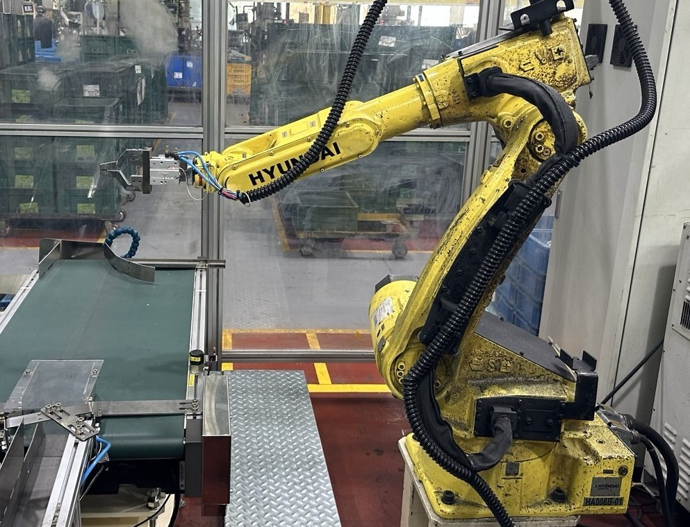

Industrial vision-guided robots require accurate alignment between **3D camera and robot coordinate systems**. Conventional calibration often relies on repeated manual teaching, making the process time-consuming and dependent on operator experience.

As part of a 3-person industry-academia research team, I focused on developing and experimentally validating methods for **automatic coordinate calibration and tool orientation optimization**.

---

### 👤 My Role

- Led implementation of the **vision–robot auto-calibration algorithm**
- Implemented **SVD plane fitting** for surface-normal estimation
- Applied **Rodrigues' rotation formula** for tool orientation calculation
- Conducted experimental data collection and validation
- Implemented forward kinematics for the **Hyundai Robotics HH020**

*Industrial robot setup used for experimental data collection and validation.*

---

### 🔧 Technical Contributions

- **Teaching-less Auto-Calibration**  
  Estimated a 4×4 homogeneous transformation matrix from controlled robot displacements, reducing reliance on repeated manual teaching.

- **Surface-Normal-Based Tool Orientation**  
  Used SVD on 3D point-cloud data to estimate local surface normals and calculate corresponding tool orientations.

- **Kinematic Analysis**  
  Modeled the HH020's 6-DOF forward kinematics to investigate configuration-dependent orientation errors & robot constraints.

*3D vision measurements used for coordinate and surface-normal analysis.*

---

### 📊 Validation

In one validation case, a target position of approximately `(200, 200)` was reconstructed as `(197.59, 202.58)`, corresponding to errors of approximately **1.21% and 1.29%** along the evaluated axes.

The experiments also showed that orientation calculations alone were insufficient at certain robot configurations, motivating further consideration of joint limits and inverse kinematics.

---

### 🏛️ Project Context

- **Program:** Ministry of Science and ICT (MSIT) / National Research Foundation of Korea
- **Grant:** `RS-2021-NR057855`
- **Technical Advisory:** Hyundai Motor Company
- **Industry Collaboration:** Ajin Industrial Co., Ltd.
- **Academic Support:** Seoul National University Industry-Academic Cooperation
- **Role:** Co-Researcher (3-person team)

---

🔗 **GitHub Repository:** [ben020410/bin_picking](https://github.com/ben020410/bin_picking)

*Implementation notebooks and experimental validation materials are available in the repository.*