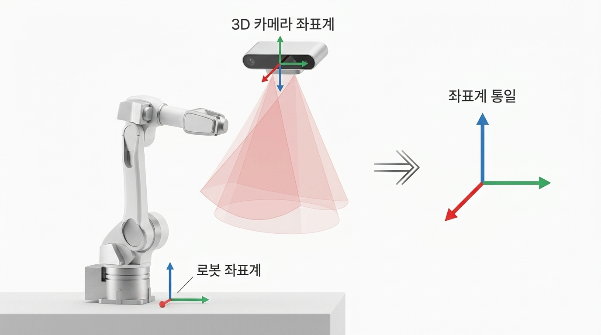

Industrial bin-picking and sanding automation pipeline developed in collaboration with **Hyundai Motor Company** and **Ajin Industrial Co., Ltd.**

### 📌 Core Technical Contributions
- **Teaching-less Auto-Calibration**: Derived a $4 \times 4$ Homogeneous Transformation Matrix using empirical displacements to eliminate manual robot teaching.
- **Tool Orientation Optimization**: Applied **SVD Plane Fitting** and **Rodrigues' Rotation Formula** to align tool orientations with 3D point cloud surface normal vectors.
- **6-DOF Kinematics Modeling**: Implemented forward kinematics for Hyundai Robotics HH020 manipulator to analyze joint limit constraints and singularities.

### 🏛️ Grant & Industry Credits
- **National R&D Project**: Ministry of Science and ICT (MSIT) / NRF (Grant No. `RS-2021-NR057855`, 180M KRW)
- **Consortium & Partners**: SNU Materials & Components Consortium, Hyundai Motor, Ajin Industrial
- **Role**: Co-Researcher (Registered in MSIT IRIS System)

---

🔗 **GitHub Repository**: [ben020410/bin_picking](https://github.com/ben020410/bin_picking)  
*(Complete mathematical derivations, Jupyter Notebooks, and SVD/Rodrigues implementation code are available in the repository.)*