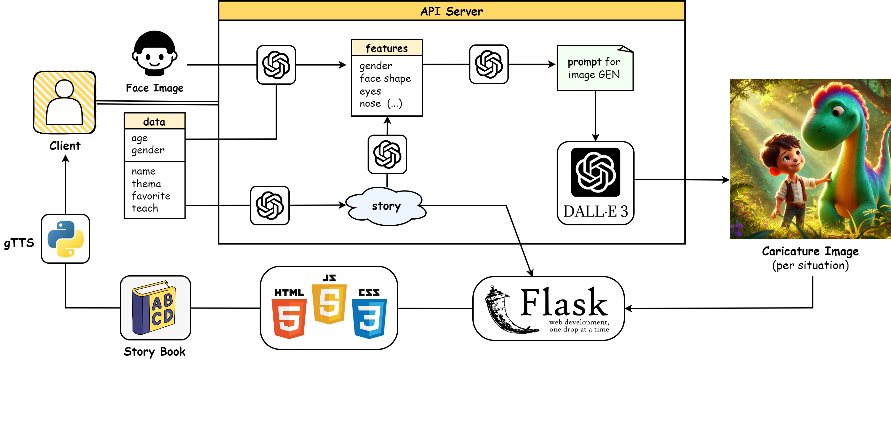

End-to-end generative AI pipeline that transforms user face images into customized caricature storybooks using multimodal prompt engineering and vision-language models.

### 📌 Core Technical Contributions
- **Facial Feature Extraction Pipeline**: Utilized **GPT-4o** to analyze key facial attributes (face shape, eyes, nose, features) from raw photos into structured JSON representations.
- **Consistent Caricature Prompting**: Built a multi-stage prompt synthesis engine combining structured visual features with story scene contexts for **DALL-E 3**, maintaining character identity consistency across storybook pages.
- **Personalized Narrative & Audio**: Generated tailored educational stories based on user inputs (age, educational goals, preferences) and rendered interactive storybooks with Flask and gTTS narration.

### 🏆 Awards & Project Details
- **Award**: **Silver Prize (3rd Place)**, 2024 AI Fusion Industry-Academia Hackathon
- **Role**: Team Lead (Designed Multimodal LLM/VLM prompt architecture and pipeline integration)

🔗 **Presentation**: <a href="/presentation_dalle.pdf" target="_blank" rel="noopener noreferrer">Hackathon Final Presentation</a>
 
🔗 **Demo Video**: <a href="/video_dalle.mp4" target="_blank" rel="noopener noreferrer">Play Demo Video</a>