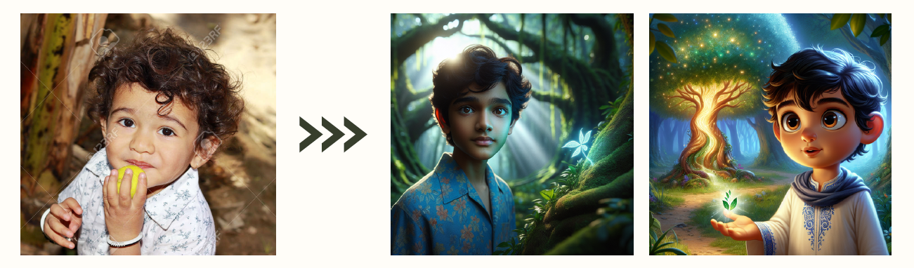

Generative AI service that turns a user's face image and personal inputs into a **customized storybook featuring the user as the main character**.

The system uses GPT-4o to extract visual characteristics and generate personalized narratives, then synthesizes those inputs into structured prompts for **DALL-E 3 storybook illustrations**.

---

### 👤 My Role

**Team Lead · MM-LLM Prompting**

- Led the 4-person hackathon team and overall project direction
- Designed prompts for **GPT-4o facial-feature extraction**
- Developed multi-stage prompts combining **visual features, story context, and scene descriptions**
- Iteratively refined DALL-E 3 prompts to improve character similarity and visual consistency
- Investigated model-specific failure cases and prompt-engineering strategies

---

### 🔧 Technical Contributions

- **Multimodal Facial Feature Extraction**  
  Used GPT-4o to convert facial images into structured attributes such as face shape, eyes, nose, and other visual characteristics.

- **Personalized Story Generation**  
  Generated story content based on user inputs including age, gender, preferences, and educational themes.

- **Character-Aware Image Prompting**  
  Combined extracted facial features with each story scene to generate DALL-E 3 prompts designed to preserve the character's visual identity.

*Pipeline from user inputs and facial images to personalized stories and DALL-E 3 illustrations.*

---

### 🔄 Trial & Error

Early experiments revealed two major limitations:

- **Prompt sensitivity and model bias** could cause generated characters to diverge from the intended facial attributes.
- **Cross-image consistency** was difficult to maintain when generating the same character across multiple story scenes.

The prompting pipeline was iteratively refined to preserve important visual features while incorporating changing scene contexts.

*Early generations showed noticeable character drift across story scenes, motivating iterative prompt refinement.*

---

### 🏆 Project Result

- **Silver Prize (3rd Place)**, 2024 AI Convergence Industry-Academia Hackathon
- Built a working personalized storybook prototype using **GPT-4o, DALL-E 3, Flask, and gTTS**
- **Role:** Team Lead / MM-LLM Prompting

---

🔗 **Presentation:** <a href="/presentation_dalle.pdf" target="_blank" rel="noopener noreferrer">Hackathon Final Presentation</a>  
 
🔗 **Demo Video:** <a href="/video_dalle.mp4" target="_blank" rel="noopener noreferrer">Play Demo Video</a>