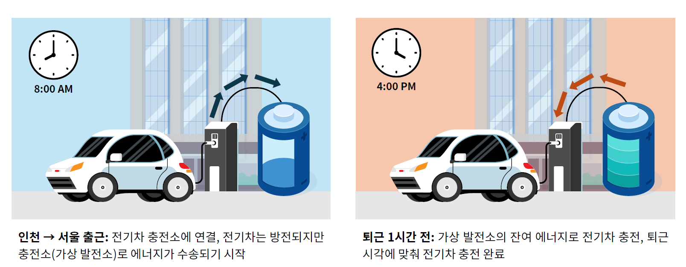
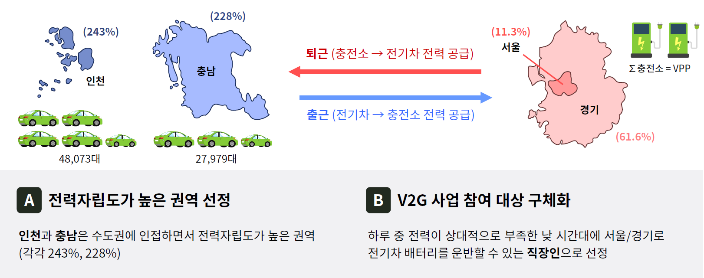
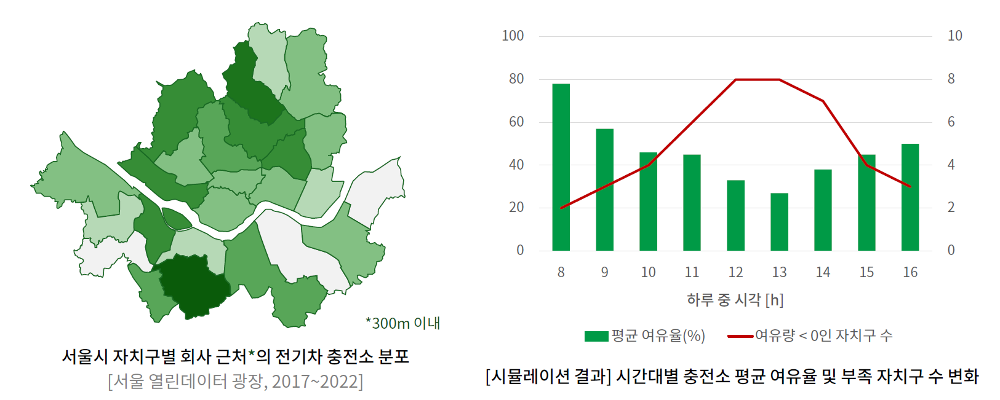
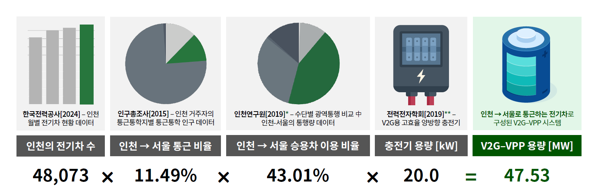

*V2G-VPP concept using commuter EVs to connect electricity-surplus regions with high-demand metropolitan areas.*

Data-driven analysis of a Korean **Virtual Power Plant (VPP)** model combining Vehicle-to-Grid (V2G) technology with commuter mobility patterns.

The project explored whether EVs commuting from electricity-surplus regions such as **Incheon and Chungnam** could act as distributed energy storage, transporting electricity into high-demand areas such as Seoul during working hours.

---

### 👤 My Role

**Team Lead · Project Manager**

- Led a 4-person interdisciplinary team and coordinated overall project execution
- Managed project structure, analysis workflow, and final presentation
- Conducted **data visualization and visual design**
- Used **Tableau, SQL, and data-analysis workflows** to communicate regional energy and simulation results
- Integrated individual analyses into the final V2G-VPP system proposal

---

### 🔧 Technical Approach

- **Regional Energy Redistribution**  
  Analyzed regional electricity generation and consumption imbalance and modeled energy flow between electricity-surplus and high-demand regions.

- **Commuter-Based V2G-VPP Model**  
  Proposed using EVs commuting from Incheon and Chungnam to Seoul as distributed energy-storage assets, discharging during working hours and recharging before returning home.

- **Charging Infrastructure Analysis**  
  Evaluated workplace charging infrastructure and time-dependent charger availability across Seoul to assess the feasibility of VPP operation.

*Workplace EV charging infrastructure and time-dependent charger availability across Seoul.*

---

### 📊 Key Results

The proposed model estimated a **47.53 MW V2G-VPP capacity** based on EVs commuting from Incheon to Seoul.

Simulation of energy transfer from Incheon and Chungnam to Seoul produced approximately **41.89 MWh of daily energy redistribution** and reduced simulated summer peak demand in Seoul by approximately **17.3 MW**.

*Simulated V2G-VPP operation reduced Seoul's summer peak demand by approximately 17.3 MW while shifting 41.89 MWh of energy.*

The V2G participation model also estimated an annual cumulative net benefit of approximately **KRW 169,000 per participating EV** under the modeled assumptions.

---

### 🏆 Project Result

- **4th Place (Association President's Award)**, 2024 CO-Data Station Data Science Contest
- **Role:** Team Lead / Project Manager
- **Focus:** Data Visualization · Project Integration · VPP/V2G System Design

---

🔗 **Presentation:** <a href="/presentation_vpp.pdf" target="_blank" rel="noopener noreferrer">CO-Data Station Final Presentation</a>