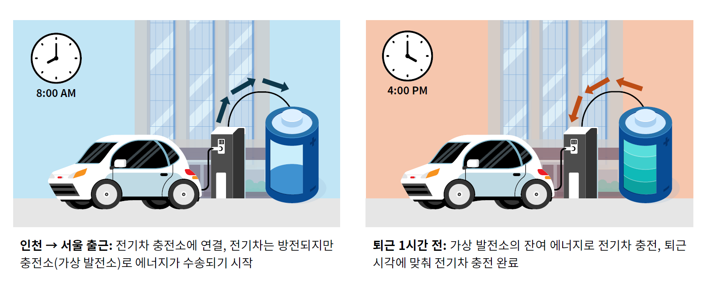

Data analytics and simulation framework for Korean Virtual Power Plants (VPP) utilizing Vehicle-to-Grid (V2G) technology to resolve regional power grid imbalances.

### 📌 Core Technical Contributions
- **Commuter-based Energy Routing Pipeline**: Modeled bidirectional energy transfer using EVs from high-supply regions (Incheon/Chungnam) commuting to high-demand capital areas (Seoul).
- **Peak Demand Reduction Simulation**: Designed a 47.53 MW V2G-VPP capacity model using Seoul workplace charger distribution and commuter demographic data, reducing Seoul's peak summer grid demand by **17.3 MW** (41.89 MWh daily shift, equivalent to 18 wind turbines).
- **Algorithmic Profitability Simulator**: Developed EV charging/discharging decision logic based on System Marginal Price (SMP) and State of Charge (SOC) thresholds, deriving an annual net incentive model (~169,000 KRW/vehicle).

### 🏆 Awards & Project Details
- **Award**: **4th Place (Association President's Award)**, 2024 CO-Data Station Data Science Contest
- **Role**: Team Lead / PM (Led mathematical modeling, simulation architecture, and Tableau data visualization)

---

🔗 **Presentation**: <a href="/presentation_vpp.pdf" target="_blank" rel="noopener noreferrer">CO-Data Station Final Presentation</a>