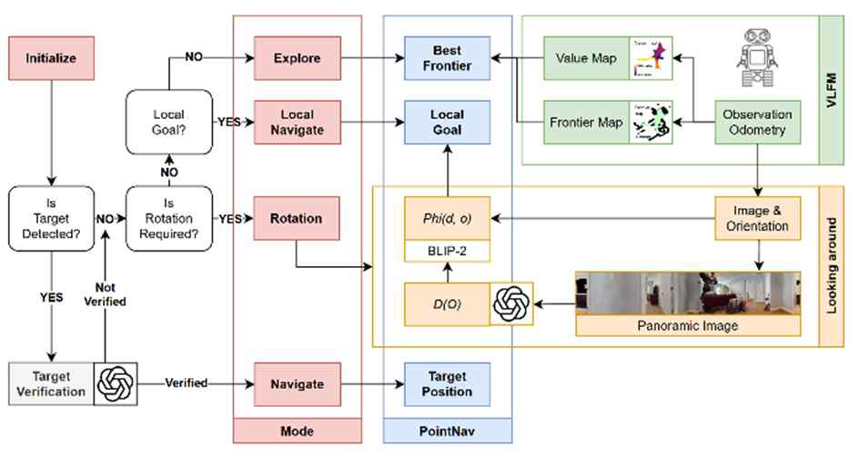

Embodied AI framework addressing the text-image modality gap in zero-shot object navigation, evaluated on **Habitat-Matterport 3D (HM3D)** and **Matterport 3D (MP3D)** benchmarks.

### 📌 Core Technical Contributions
- **Textual Intermediate Representation**: Generated panoramic 360° scene descriptions using **GPT-4o**, bridging the text-image modality gap by performing relevance matching in high-density text embedding spaces (BLIP-2).
- **Dynamic Decision-Making**: Implemented an intuitive rotation trigger logic that selectively activates panoramic observation only at high-uncertainty decision points, significantly optimizing computational efficiency.
- **Target Verification Module**: Built a dual-stage filtering pipeline combining VLM contextual re-evaluation with count-based cumulative detection to eliminate persistent false positives.
- **SOTA Benchmark Performance**: Achieved **55.0% SR** and **33.7% SPL** on HM3D (+3.3%p SPL over VLFM baseline).

### 🏛️ Venue & R&D Credits
- **Proceedings**: 21st Korea Robotics Society Annual Conference (**KRoC 2026**) / Korea Robotics Society (KROS)
- **Grant Support**: **Samsung Electronics** Research Funding & Incubation Center (Project No. `SRFC-IT2402-17`)
- **Authors**: Yeongmok Cho, **Semin Na**, Jeongjun Choi, H. Jin Kim (Seoul National University)

---

🔗 **Paper**: <a href="/KRoC2026_ZSON.pdf" target="_blank" rel="noopener noreferrer">📄 KRoC 2026 Paper</a>